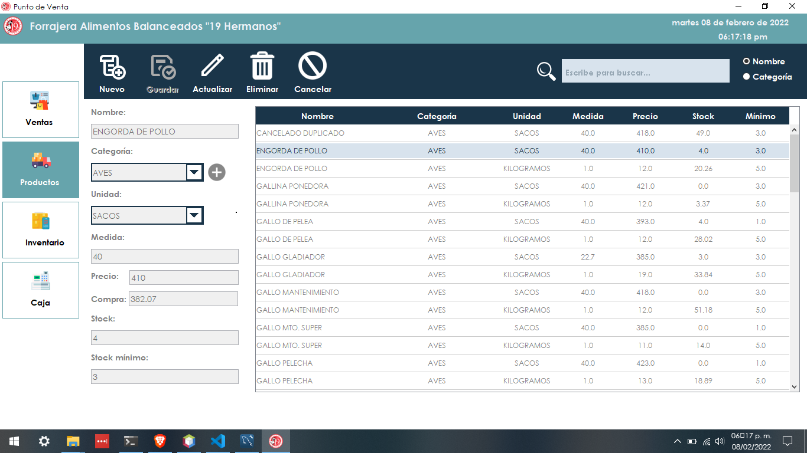
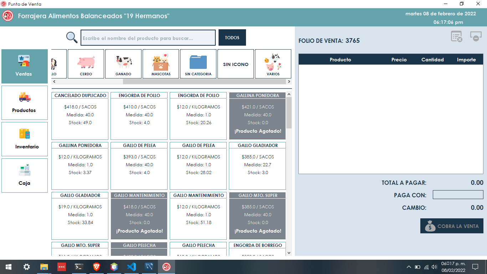

# Point of Sale for Forage

This project is a real project of a Point of Sale, it was acquired by one of my clients.

This project was developed based on the needs of my client, adding unique functionalities, required by him, as well as an original design, created by the author and associates. This point of sale is unique in the market, it is not a copy of the existing ones, fully functional and showing only the functions that the client needs.

# Author

## Ing. Jorge de Jesus Perez Lopez.

### Visit my web portfolio to see more projects and find more information: [Web Portfolio](https://portfolio-jorgeperez.netlify.app/)

For the development of this project, no other was taken as a basis, the methodology used was a traditional methodology, since the project required it:

1. Approach.
2. Analysis.
3. Design.
4. Programming.
5. Testing
6. Use and maintenance.

Some of the functions that this system achieves are the following:

- Cash opening.
- Product management.
- Inventory management.
- Cash flow management.
- Sales and ticket printing.
- Box cut and box cut printing.
- Cancellation of sales.
- Visualization of sales made, canceled and by shifts.
- Close the box.

# Copy Right &copy;

Due to being a system that was sold to a client, the source code belongs to the author, however, it cannot be shared due to the characteristics that this project has. If you want to have access to a demo, please contact the author.

If you want a similar system, or of any kind, you can contact the author to make a quote.

This project can be adapted to any business, including **School Projects**, for more information contact the author.

At the end, in this same file, you will be able to find some images that show the operation of the system, where you will be able to see the customization used in a unique, friendly and fully functional design.

 

---

`Versión en Español`

---

 

# Punto de Venta para Forrajera

Este proyecto, es un proyecto real de un Punto de Venta, fue adquirido por uno de mis clientes.

Este proyecto, fue elaborado en base a las necesidades de mi cliente, agregando funcionalidades únicas, requeridas por él, así como también, se mostró un diseño original, creado por el autor y asociados. Este punto de venta es único en el mercado, no es copia de los ya existentes, totalmente funcional y mostrando únicamente las funciones que el cliente necesita.

# Autor

## Ing. Jorge de Jesús Pérez López.

### Visita mi portafolio web para ver más proyectos y encontrar más información: [Portafolio Web](https://portfolio-jorgeperez.netlify.app/)

Para el desarrollo de este proyecto, no se tomó como base ningún otro, la metodología utilizada fue una metodología tradicional, ya que el proyecto así lo demandaba:

1. Planteamiento.
2. Análisis.
3. Diseño.
4. Programación.
5. Pruebas
6. Uso y mantenimiento.

Algunas de las funciones que este sistema logra, son las siguientes:

- Apertura de caja.
- Gestión de productos.
- Gestión de inventario.
- Gestión del flujo de caja.
- Realización de venta e impresión de ticket.
- Corte de caja e impresión del corte de caja.
- Cancelación de ventas.
- Visualización de ventas realizadas, canceladas y por turnos.
- Cierre de caja.

# Copy Right &copy;

Debido a ser un sistema que fue vendido a un cliente, el código fuente pertenece al autor, sin embargo, no puede ser compartido debido a las características con las que cuenta este proyecto. Si desea tener acceso a una demostración, por favor contacte al autor.

Si desea un sistema similar, o de cualquier tipo, puede contactar al autor para hacer una cotización.

Este proyecto puede ser adaptado a cualquier negocio, inclusive a **Proyectos Escolares**, para más información contacte al autor.

Al final, en este mismo archivo, podrá encontrar algunas imágenes que muestran el funcionamiento del sistema, donde podrá ver la personalización utilizada en un diseño único, amigable y totalmente funcional.

 

---

## Contact

### [GitHub](https://github.com/jodeperezlo)

### [LinkedIn](https://www.linkedin.com/in/jorge-de-jes%C3%BAs-p%C3%A9rez-l%C3%B3pez-140343216/)

### Find my contact email on my website [Jorge Perez Portfolio](https://portfolio-jorgeperez.netlify.app/).

 

---

